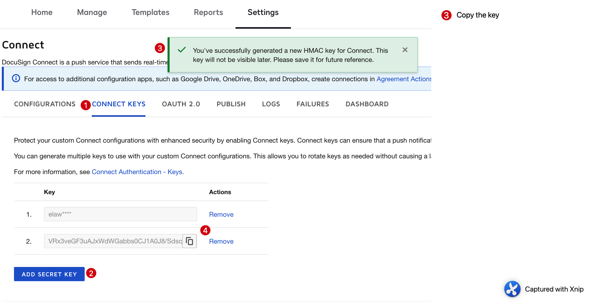
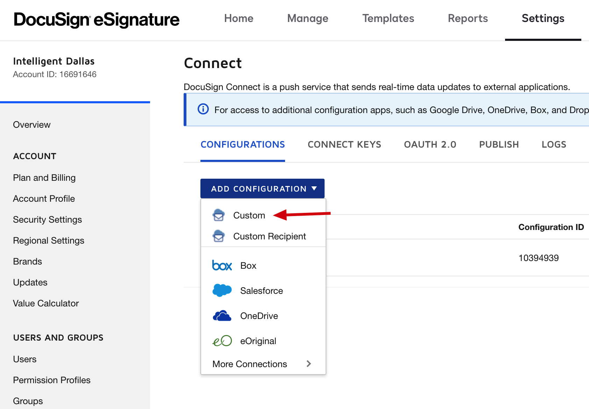
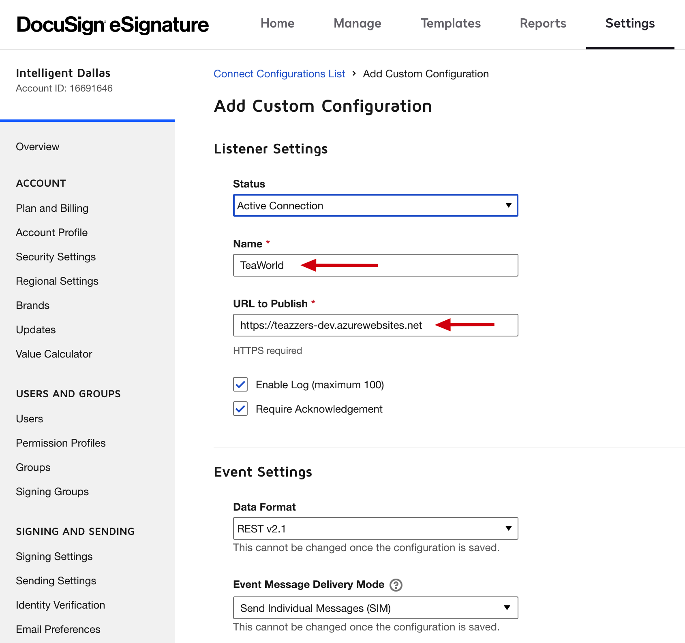
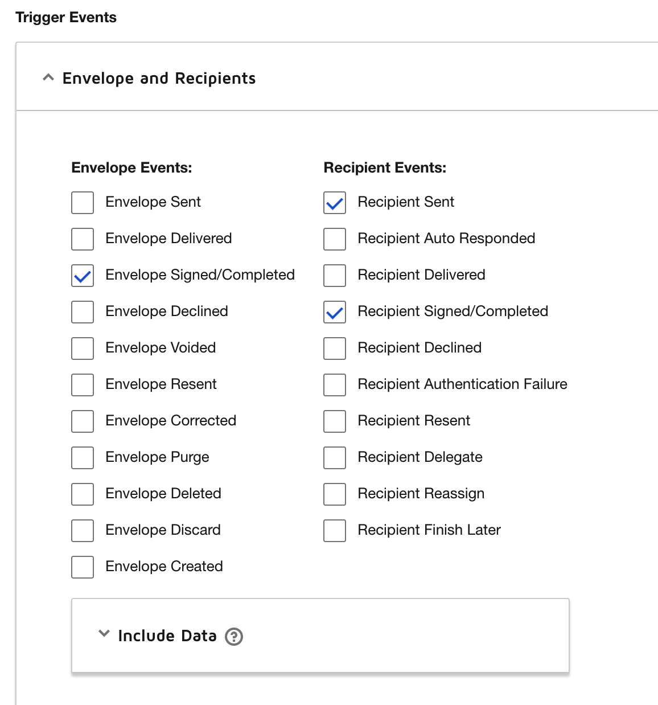
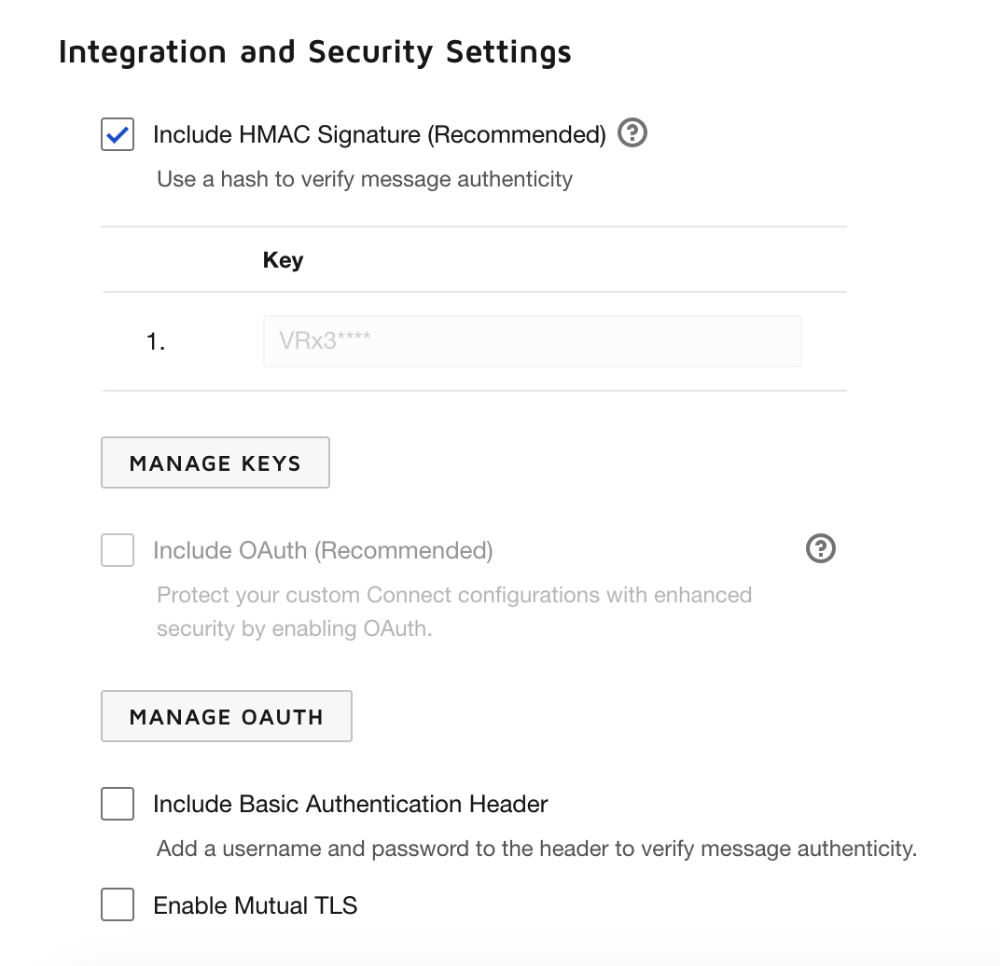

# DocuSign Outbound Integration

The purpose of this project is to demonstrate the set up of outbound integration in DocuSign. DocuSign can send notifications about updates to external applications.

DocuSign has a feature called `Connect` that allows you to set up webhook notifications for various events, including when a document is signed.

To set up `Connect`, you'll need to configure a listener application that can receive and process the webhook notifications. This can be any application that can receive HTTP(S) requests such as Web Application, API Gateway or Function service. Once you have your listener application set up, you can create a Connect configuration in your DocuSign account that specifies the events you want to be notified about and the URL of your listener application.

When a document is signed, DocuSign will send a webhook notification to the URL of your listener application. Your application can then process the notification and take any necessary actions, such as updating a database or sending an email notification.

## Using HMAC Security with DocuSign Connect
### Why use HMAC
DocuSign Connect enables you to secure your Connect listener with Hash-based Message Authentication Code (HMAC), an industry standard symmetric hashing system. Once HMAC is enabled, special header values will be included in your Connect messages that you can use to verify:
- That the message was sent by DocuSign Connect (authenticity).
- That the message contents are exactly the same as they were at the time of sending (integrity).

When using HMAC security, each message sent from your DocuSign Connect account includes additional header values, one for each HMAC key you have defined (up to one hundred), which will contain the message body hashed with one of your HMAC keys, using HMAC-SHA256. For example, if you have defined two keys, then two headers, X-DocuSign-Signature-1 and X-DocuSign-Signature-2, will be added. They will contain the message body hashed with your first and second secret keys, respectively.

After receiving the message containing the HMAC header values, your app must validate that they are authentic by re-creating them. If the message body (including line ends) hashed with one of the HMAC keys matches one of the provided HMAC header values, you can verify that the message came from DocuSign (only DocuSign and your app have access to the secret HMAC keys).

    Note: You can use any of your created HMAC header values (Signature-1 or Signature-2, for example) to verify the authenticity of the message.

### Set up HMAC key for Connect
Before setting up a `Connect` configuration, you should create a HMAC key that can be used by the configuration.

Go to the [Dashboard](https://admindemo.docusign.com/admin-dashboard) and choose the Settings tab.

Choose `Integrations > Connect` from the menu on the left. Go to `Connect Keys` option and click `Add Secret Key`. A new key will be generated. This is the only time key will be visible, it should be copied and kept in a secure location that can be accessed by your listener.



## Set up DocuSign Connect 
You must use the same DocuSign account you created for eSignature API (see https://git.valueglobal.net/sjejurkar/docusign-pdf-poc#docusign-developer-account).

Go to the [Dashboard](https://admindemo.docusign.com/admin-dashboard) and choose the Settings tab.

Choose `Integrations > Connect` from the menu on the left.

Click on `Add Configuration` and choose `Custom`.


Under `Listener Settings` add the `Name` for this configuration and the listener URL as `URL to Publish`.


In `Envelope and Recipients` section under `Trigger Events` , check the boxes for `Envelope Signed/Completed`, `Recipient Sent` and `Recipient Signed/Completed` as these are the events our application needs notifications for.


In `Integration and Security Settings` section, check the `Include HMAC Signature (Recommended)` box. You should see the first few characters of the key created earlier. 


Leave default values for all other options and click `Add Configuration`. Now Docusign Connect is set up to send event notifications to your listener endpoint.

## Sample code for Azure Function
Folder `DocuSignConnectHandler` contains code for a listener implemented using Azure Functions. This code gets the DocuSign Signature from the reequest header and validates it.

The DocuSign Connect key is read from environment variable (Azure Function configuration). If you want to run this function locally, add a value for `DS_CONNECT_KEY` to `local.settings.json` file as shown below:

```json
{
  "IsEncrypted": false,
  "Values": {
    "AzureWebJobsStorage": "",
    "FUNCTIONS_WORKER_RUNTIME": "dotnet",
    "DS_CONNECT_KEY": "DId0nFSjZxvojSRvAs19tZv1ErWZEhzYQm+UNNBmwVE="
  }
}
```